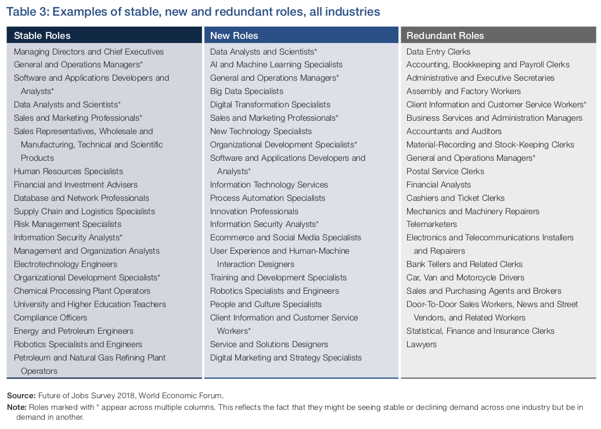

## Topics for impromptu speeches

+ The coming of the MOOCS has led to many predictions about the future of education, especially the higher education. One prediction is: in future, all students will have equal access to the best education through online courses given by the best professors. It is predicted that most of the universities will close down and the majority of the professors will become teaching assistants, or lose their jobs. However, it will be a blessing for students because they will all enjoy the same opportunity to study for world-class degrees. That is progress and that is the future of higher education! What do you think about this prediction? Why?

+ In such a world of drastic change and rapid development in every field of our life, why the classics are still being cherished and read?

+ In A Short History of Chinese Philosophy, Fung Yu-lan describes the purpose of the study of philosophy as "to enable a man, as a man, to be a man, not some particular kind of man". What is your understanding of his idea?

+ The skill at unmasking error, or simple intellectual one-upmanship, is not completely without value, but we should be wary of creating a class of self-satisfied debunkers or, to use a currently fashionable word on campuses, people who like to "trouble" ideas. In overdeveloping the capacity to show how texts, institutions, or people fail to accomplish what they set out to do, we may be depriving students of the capacity to learn as much as possible from what they study. In a humanities culture in which being smart often means being a critical unmasker, our students may become too good at showing how things don't make sense. That very skill may diminish their capacity to find or create meaning and direction in the books they read and the world in which they live. Once outside the university, our students continue to score points by displaying the critical prowess for which they were rewarded in school. They wind up contributing to a cultural climate that has little tolerance for finding or making meaning, whose intellectuals and cultural commentators delight in being able to show that somebody else is not to be believed. What is your understanding of this passage?

+ Some people say that the superabundance of information is devaluing knowledge. Do you agree? Why?

+ Dear Carlos: I desperately need a dean's excuse for my chem midterm which will begin in about 1 hour. All I can say is that I totally blew it this week. I've fallen incredibly, inconceivably behind.  
Carlos: Help! I'm anxious to hear from you. I'll be in my room and won't leave it until I hear from you. Tomorrow is the last day for... 
Carlos: I left town because I started bugging out again. I stayed up all night to finish a take-home make-up exam & am typing it to hand in on the 10th. It was due on the 5th. P.S. I'm going to the dentist. Pain is pretty bad.  
Carlos: Probably by Friday I'll be able to get back to my studies. Right now I'm going to take a long walk. This whole thing has taken a lot out of me.  
Carlos: I'm really up the proverbial creek. The problem is I really bombed the history final. Since I need that course for my major...  
Carlos: Here follows a tale of woe. I went home this weekend, had to help my Mom, & caught a fever so didn't have much time to study. My professor...  
Carlos: Aargh!! Trouble. Nothing original but everything's piling up at once. To be brief, my job interview...  
What you have just read are the messages that some college students left for their dean Calors Hortas. Being a college student, have you experienced any similar or different pressures as described above? How have you been dealing with them?

+ The Future of Jobs Report 2018 presents information and data that were compiled and/or collected by the World Economic Forum. In the following table, we can see examples of stable, new and redundant roles, showing the workforce trends in all industries up to 2022. 
{:height="500"}
  + How do you view these trends?
  + What do you think should college education do to prepare college students for the future?
  + What do you think should college students do to prepare themselves for the future?

+ The joys of parents are secret; and so are their griefs and fears. They cannot utter the one; nor they will not utter the other. Children sweeten labors; but they make misfortunes more bitter. They increase the cares of life; but they mitigate the remembrance of death.
  What is your understanding of this statement?

+ In an article in the January 1998 issue of Wired, a science journalist muses about the day—twenty? fifty? a hundred years from now?—when parents will be able to shop for their children's genes as easily as today they shop for their jeans. "Genotype choice," the journalist calls it. Would you like a girl or a boy? Curly hair or straight? A whiz at math or a winner of spelling bees? "It would give parents a real power over the sort of people their children will turn out to be," he says. 
  How do you think of such a “power “of parents?

+ Man is the measure of all things.
