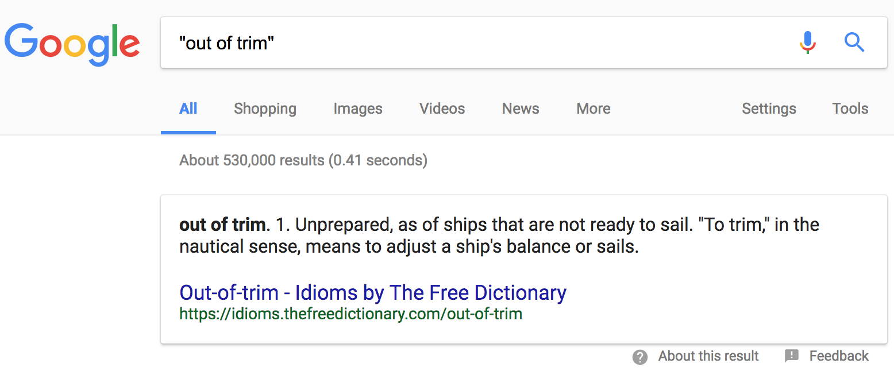

class: center, middle
# Science and Culture
## The importance of natural science in general education

Thomas Henry Huxley 
(1825-1895)

---

class: center, middle
# But the Nemesis of all reformers is finality...

---
## The importance of intellectual progress

There are many questions - and among them those that are of the profoundest interest to our spiritual life - which, so far as we can see, must remain insoluble to the human intellect unless its powers become of quite a different order from what they are now.

.right[Bertrand Russell: _The Value of Philosophy_]

## The cause and the conse­quence of intellectual progress

+ The advancement of knowledge

+ The promotion of the freedom of thought

---
## But the Nemesis of all reformers is finality...

** Nemesis ** | ˈnɛmɪsɪs | .smaller[Greek Mythology]

+ a goddess usually portrayed as the agent of divine punishment for wrongdoing or presumption (hubris)
+ the inescapable agent of someone's or something's downfall

** finality **  	    

+ the quality of being final and impossible to change 
.smaller[If you say something with finality, you say it in a way that shows that you have made up your mind about something and do not want to discuss it further. (FORMAL)
e.g. _'Not this time, Faye,' he replied with finality._]

** avenue **

+ a wide, straight road, especially one with trees on either side
+ a way of getting something done.

???
How do you interpret this?
hubris | ˈhjuːbrɪs | excessive pride or self-confidence

---
## out of trim

---
## Andromeda, Perseus, and the monster

<video width="640" controls src="images/andromeda.mp4" type="video/mp4"</video>

---

class: center, middle
## But the Nemesis of all reformers is finality.

# And the Nemesis of critical thinking is also finality.
