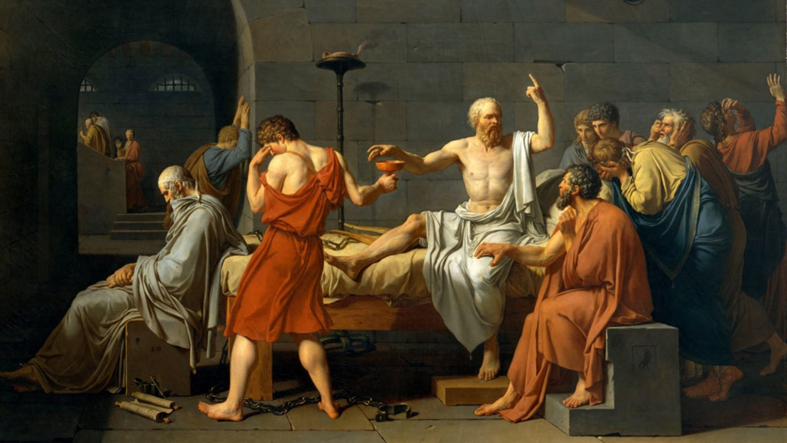
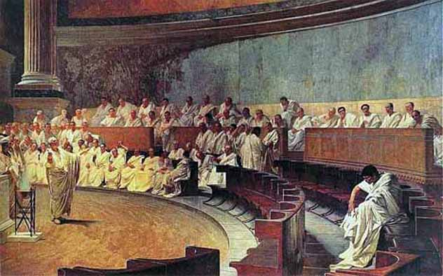

class: center, middle
# 人文教育中公共演说课程的教学探索

###  柏晓静

###  清华大学外文系

.smaller[
** bxj@tsinghua.edu.cn **
]
---
## **中期汇报内容**

+ 教学理念

+ 教学内容

+ 资源建设

+ 现状考察

+ 规划展望

---
## **教学理念探索**

人文教育：心智的解放与成长

+ 探索、思辨、创新

+ 传统、价值、共识

???
The rhetorical thread is reverential, focused on bringing new members into the common culture.
Learn to appreciate or to participate in traditions of compelling cultural interest. This framework helps students understand their connections with others and with canonical works in religion, art, literature, science, and music (to name just some strands of cultural interest).

---
.left-column-2[
## **教学理念探索**

人文教育中的公共演说教育

+ 人文思考

+ 公民参与

+ 博学与共识
]

.right-column-2[

      

]
---
.left-column-4[

## **教学理念与教学内容**

人文教育中的公共演说教育

+ ** 人文思考 **

+ 公民参与

+ 博学与共识

]

.right-column-4[
    
.smaller[
"... though the outside of human life changes much, the inside changes little..."
  .right[Edith Hamilton]
]
]

---
.left-column-2[

## **教学理念与教学内容**

人文教育中的公共演说教育

+ ** 人文思考 **

+ 公民参与

+ 博学与共识

]

.right-column-4[
.left-column-4[

]
.right-column-3[
> .smaller[

Life 
Death 
Poverty 
War 
Harmony 
Greed 
Democracy 
Freedom 
Idealism 
Courage 
Science 
Culture 
Globalization 
Exploration 
Communication 
... 
...

]
]
]

---
.left-column-2[

## **教学理念与教学内容**

人文教育中的公共演说教育

+ 人文思考

+ ** 公民参与 **

+ 博学与共识

]

.right-column-4[
.smaller[
 

<strong>Tradition of public speaking</strong> 
演说舞台 
bema 
rostrum  

<strong>Value of public speaking</strong> 
Civic engagement 
Social progress  

<strong>Transparent conversation</strong> 
"... nor putting on that countenance of discontent, which pains though it cannot punish."

]
]

---
.left-column-2[

## **教学理念与教学内容**

人文教育中的公共演说教育

+ 人文思考

+ 公民参与

+ ** 博学与共识 **

]

.right-column-4[
.smaller[
 
“......各筑垣墙，自为疆境......以各不相通之人物，而相互从事于国家社会共通之事业...”
 .right[钱穆]
]
]

---
.left-column-2[

## **教学理念与教学内容**

人文教育中的公共演说教育

+ 人文思考

+ 公民参与

+ ** 博学与共识 **

]

.right-column-4[
.smaller[
 
“......各筑垣墙，自为疆境......以各不相通之人物，而相互从事于国家社会共通之事业...”
 .right[钱穆]
  
<video width="370" controls src="images/class_1.mp4" type="video/mp4"</video>
]
]

---
.left-column-2[

## **教学理念与教学内容**

人文教育中的公共演说教育

+ 人文思考

+ 公民参与

+ ** 博学与共识 **

]

.right-column-4[
.smaller[

 
<strong>What's special  
about my major?</strong>
  
Cicero: doclus orator 
a learned/cultured orator 
博雅演说家
  
"... no man can be eloquent on a subject that he does not understand..."  
"...if he understands a subject ever so well, but is ignorant how to form and polish his speech, he cannot express himself eloquently even about what he does understand..."

]
]

???
(of a person) having acquired much knowledge through study
characterized by refined taste and manners and good education

---
.left-column-2[

## **教学理念与教学内容**

人文教育中的公共演说教育

+ 人文思考

+ 公民参与

+ ** 博学与共识 **

]

.right-column-4[
.smaller[

 
<strong>What's special  
about my major?<strong>

<video width="370" controls src="images/class_3.mp4" type="video/mp4"</video>
]
]

---
## **资源建设**

+ 演说词文本

  .smaller[不同风格的演说词：它们或义愤填膺、或慷慨激昂、或博大精深、或明智睿哲、或感悟满怀、或诗意盎然、或辛辣尖刻、或风趣幽默。]

+ 相关历史文化读本

+ 多媒体资源

+ 学生习作

---
## **现状考察**

+ 英美大学演说类课程考察

+ 中国大学演说类课程考察

+ 中国英文演说赛事考察

---
## **规划展望**

+ 教学理念

+ 教学内容

+ 资源建设

+ 现状考察

???
不花哨不华丽是没法在演讲比赛中脱颖而出的
你不觉得演讲比赛就是在鼓励这种人吗？
用真心去讲述！
---
class: center, middle
**请多指教，谢谢！**
